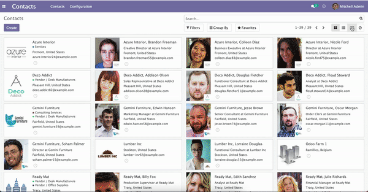

# Web Google Maps



This module contains three new features:
 - New view type and mode `"google_map"`
 - New widget `"gplaces_address_autocomplete"`
 - New widget `"gplaces_autocomplete"`
 

## Map view  `"google_map"`
Enable you to display `res.partner` geolocation on map or any model contains geolocation.   
This feature will work seamlessly with Odoo means you can search your partner location using Odoo search feature.     

These are available attributes that you can customize
 - `lat` : an attritube to tell the map the latitude field __[mandatory]__
 - `lng` : an attritute to tell the map the longitude field __[mandatory]__
 - `color` : an attribute to modify marker color, any given color will set all markers color __[optional]__.
 - `colors` : work like attribute `color` but more configurable (you can set marker color depends on condition you defined)  __[optional]__
 - `library` : an attribute to indicates which google map library to load.    
    This options has two values:   
    1. `geometry` [default]
    2. <s>`drawing`</s>
 - `disable_cluster_marker`: if you want to disable cluster marker, you can set this attribute to `True` __[optional]__
 - `gesture_handling`: gesture control for the map. Available options: `cooperative`, `greedy`, `auto(default)` [source](https://developers.google.com/maps/documentation/javascript/interaction#controlling_gesture_handling)  __[optional]__
### How to create the view?    
Example
```xml
    <!-- View -->
    <record id="view_res_partner_map" model="ir.ui.view">
        <field name="name">view.res.partner.map</field>
        <field name="model">res.partner</field>
        <field name="arch" type="xml">
            <google_map class="o_res_partner_map" string="Map" lat="partner_latitude" lng="partner_longitude"  colors="blue:company_type=='person';green:company_type=='company';" disable_cluster_marker="True" gesture_handling="cooperative">
                <field name="id"/>
                <field name="partner_latitude"/>
                <field name="partner_longitude"/>
                <field name="color"/>
                <field name="display_name"/>
                <field name="title"/>
                <field name="email"/>
                <field name="parent_id"/>
                <field name="is_company"/>
                <field name="function"/>
                <field name="phone"/>
                <field name="street"/>
                <field name="street2"/>
                <field name="zip"/>
                <field name="city"/>
                <field name="country_id"/>
                <field name="mobile"/>
                <field name="state_id"/>
                <field name="category_id"/>
                <field name="image_128"/>
                <field name="type"/>
                <field name="company_type"/>
                <templates>
                    <t t-name="kanban-box">
                        <div class="oe_kanban_global_click o_kanban_record_has_image_fill o_res_partner_kanban">
                            <t t-if="!record.is_company.raw_value">
                                <t t-if="record.type.raw_value === 'delivery'" t-set="placeholder" t-value="'/base/static/img/truck.png'"/>
                                <t t-elif="record.type.raw_value === 'invoice'" t-set="placeholder" t-value="'/base/static/img/money.png'"/>
                                <t t-else="" t-set="placeholder" t-value="'/base/static/img/avatar_grey.png'"/>
                                <div class="o_kanban_image_fill_left d-none d-md-block" t-attf-style="background-image:url('#{kanban_image('res.partner', 'image_128', record.id.raw_value,  placeholder)}')">
                                    
                                </div>
                                <div class="o_kanban_image rounded-circle d-md-none" t-attf-style="background-image:url('#{kanban_image('res.partner', 'image_128', record.id.raw_value,  placeholder)}')">
                                    
                                </div>
                            </t>
                            <t t-elif="record.image_128.raw_value">
                                <t t-set="placeholder" t-value="'/base/static/img/company_image.png'"/>
                                <div class="o_kanban_image_fill_left o_kanban_image_full" t-attf-style="background-image: url(#{kanban_image('res.partner', 'image_128', record.id.raw_value, placeholder)})" role="img"/>
                            </t>
                            <div class="oe_kanban_details">
                                <strong class="o_kanban_record_title oe_partner_heading"><field name="display_name"/></strong>
                                <div class="o_kanban_tags_section oe_kanban_partner_categories"/>
                                <ul>
                                    <li t-if="record.parent_id.raw_value and !record.function.raw_value"><field name="parent_id"/></li>
                                    <li t-if="!record.parent_id.raw_value and record.function.raw_value"><field name="function"/></li>
                                    <li t-if="record.parent_id.raw_value and record.function.raw_value"><field name="function"/> at <field name="parent_id"/></li>
                                    <li t-if="record.city.raw_value and !record.country_id.raw_value"><field name="city"/></li>
                                    <li t-if="!record.city.raw_value and record.country_id.raw_value"><field name="country_id"/></li>
                                    <li t-if="record.city.raw_value and record.country_id.raw_value"><field name="city"/>, <field name="country_id"/></li>
                                    <li t-if="record.email.raw_value" class="o_text_overflow"><field name="email"/></li>
                                </ul>
                                <div class="oe_kanban_partner_links"/>
                            </div>
                        </div>
                    </t>
                </templates>
            </google_map>
        </field>
    </record>
    
    <!-- Action -->
    <record id="action_partner_map" model="ir.actions.act_window">
        ...
        <field name="view_mode">kanban,tree,form,google_map</field>
        ...
    </record>
```

The view looks familiar?    
Yes, you're right.    
The marker infowindow will use `kanban-box` kanban card style.    


### How to setup color for marker on map?
There are two attributes:
 - `colors`     
 Allow you to display different marker color to represent a record on map
 - `color`    
 One marker color for all records on map


Example:
```xml
    <!-- colors -->
    <google_map string="Map" lat="partner_latitude" lng="partner_longitude" colors="green:company_type=='person';blue:company_type=='company';">
        ...
    </google_map>

    <!-- color -->
    <google_map string="Map" lat="partner_latitude" lng="partner_longitude" color="orange">
        ...
    </google_map>
```

## New widget `"gplaces_address_autocomplete"`

New widget to integrate [Place Autocomplete Address Form](https://developers.google.com/maps/documentation/javascript/examples/places-autocomplete-addressform).  
 ### Widget options:

 1. Google componennt `component_form`   
Is an option used to modify which value you want to take from an objects returned by the geocoder.    
Full documentation about Google component types can be found [here](https://developers.google.com/maps/documentation/geocoding/intro#Types)
By default this option are configured like the following value
```javascript
    {
        street_number: 'long_name',
        route: 'long_name',
        intersection: 'short_name',
        political: 'short_name',
        country: 'short_name',
        administrative_area_level_1: 'short_name',
        administrative_area_level_2: 'short_name',
        administrative_area_level_3: 'short_name',
        administrative_area_level_4: 'short_name',
        administrative_area_level_5: 'short_name',
        colloquial_area: 'short_name',
        locality: 'short_name',
        ward: 'short_name',
        sublocality_level_1: 'short_name',
        sublocality_level_2: 'short_name',
        sublocality_level_3: 'short_name',
        sublocality_level_5: 'short_name',
        neighborhood: 'short_name',
        premise: 'short_name',
        postal_code: 'short_name',
        natural_feature: 'short_name',
        airport: 'short_name',
        park: 'short_name',
        point_of_interest: 'long_name',
        floor: 'short_name',
        establishment: 'short_name',
        point_of_interest: 'short_name',
        parking: 'short_name',
        post_box: 'short_name',
        postal_town: 'short_name',
        room: 'short_name',
        bus_station: 'short_name',
        train_station: 'short_name',
        transit_station: 'short_name',
    }
```
This configuration can be modify into view field definition.    
Example:
```xml
    <record id="view_res_partner_form" model="ir.ui.view">
       ...
       <field name="arch" type="xml">
            ...
            <field name="street" widget="gplaces_address_form" options="{'component_form': {'street_number': 'short_name'}}"/>
            ...
        </field>
    </record>
```

 2. Odoo fields mapping `fillfields`   
Is an option that will be influenced by `gplaces_address_autocomplete` widget.    
This options should contains known `fields` that you want the widget to fulfill a value for each given field automatically.    
A field can contains one or multiple elements of component form    
By default this options are configured like the following
```javascript
    {
        'street': ['street_number', 'route'],
        'street2': ['administrative_area_level_3', 'administrative_area_level_4', 'administrative_area_level_5'],
        'city': ['locality', 'administrative_area_level_2'],
        'zip': 'postal_code',
        'state_id': 'administrative_area_level_1',
        'country_id': 'country',
    }
```
        
This configuration can be modify into view field definition as well    
Example:
```xml
    <record id="view_res_partner_form" model="ir.ui.view">
        ...
        <field name="arch" type="xml">
            ...
            <field name="street" widget="google_places" options="{'fillfields': {'street2': ['route', 'street_number']}}"/>
            ...
        </field>
    </record>
```    

 3. Geolocation fields latitude `lat` and longitude `lng`    
This options tell the widget the fields geolocation, in order to have this fields filled automatically.

 4. Address mode `mode`    
    Is an option that will be used to define the mode of the widget. Either by populate the Google address into Odoo fields or just simply take the Google address into your Char field.    
    Available values are `'address_format'` and `'no_address_format'`.    
    Example:
    ```xml
        <field name="address" widget="gplaces_address_autocomplete" options="{
            'mode': 'no_address_format', 
            'lat': 'latitude', 
            'lng': 'longitude', 
            'display_name': 'formatted_address', 
            'types': []}"
        />
    ```
    It's recommended to also defined geolocation fields (latitude and longitude) so that you see can the address on map.   

   5. Place autocomplete requests [`types`](https://developers.google.com/maps/documentation/places/web-service/supported_types#table3)


## New widget `"gplaces_autocomplete"`

New widget to integrate [Place Autocomplete](https://developers.google.com/maps/documentation/javascript/examples/places-autocomplete) in Odoo.

### Widget options:
This widget have similar configuration to `gplaces_address_autocomplete` except for ```mode``` option.

1. Fill fields `fillfields`   
This configuration works similar to `gplaces_address_autocomplete`.
By default this options are configured like following value:
```javascript
    {
        general: {
            name: 'name',
            website: 'website',
            phone: ['international_phone_number', 'formatted_phone_number']
        },
        geolocation: {
            partner_latitude: 'latitude',
            partner_longitude: 'longitude'
        },
        address: {
            street: ['street_number', 'route'],
            street2: ['administrative_area_level_3', 'administrative_area_level_4', 'administrative_area_level_5'],
            city: ['locality', 'administrative_area_level_2'],
            zip: 'postal_code',
            state_id: 'administrative_area_level_1',
            country_id: 'country'
        }
    };
```
## Technical
This module will install `base_setup` and `base_geolocalize`.    
*I recommend you to setup __Google Maps Key API__ and add it into Odoo `Settings > General` Settings when you installed this module*

*__List of Google APIs & services required in order to make all features works__*
- Geocoding API
- Maps JavaScript API
- Places API

Visit this [page](https://developers.google.com/maps/documentation/javascript/get-api-key) of how to get Google API Key


If you discover a bug, please create an issue.    
If you want to contribute, please fork the repository and create a pull request.
